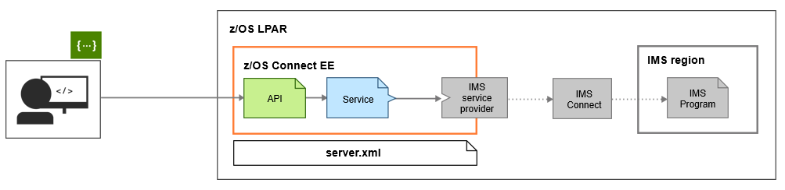

# IMS application as a REST API provider with z/OS Connect EE

Application programming interfaces (APIs) are the digital glue that links services, applications, and systems. You can enable IMS™ applications as REST services and define REST APIs for these services. This sample uses IBM® z/OS® Connect Enterprise Edition (z/OS Connect EE) V3 as the solution.

## Scenario
The IMS sample telephone book application (also known as the phonebook application, or the IVTNO transaction) is exposed as a REST service, and a REST API is created to issue a GET request to look up the contact information for a given last name. 

## Program flow and architecture
This scenario uses a z/OS Connect EE server to host the REST API and the service.  The IMS service provider that comes with z/OS Connect EE handles the communication with IMS Connect.

z/OS Connect EE provides an API toolkit, an Eclipse plugin to install into IBM Explorer for z/OS, that lets you create a service from a COBOL copybook or PL/I include, define the request and response service interfaces, and specify how the service can access and interact with IMS.  After a service is created, use the API toolkit to create a REST API from the service.

## Technology demonstrated
* <strong>z/OS Connect EE V3/open beta</strong>  
  There are two options to try out this solution:
  * <u>Option 1</u>.  To try out z/OS Connect EE with no cost, installation, or configuration, go to the [IBM Z Trial Program](https://www.ibm.com/systems/z/trials.html) site, look for the z/OS Connect Enterprise Edition box, and register.  A sandbox environment will be prepared for you.  A tutorial is provided in the sandbox based on the IMS phonebook application.
  * <u>Option 2</u>. [Download the z/OS Connect EE open beta code](https://www-01.ibm.com/marketing/iwm/iwm/web/pick.do?source=swerpsw-p3192-3&lang=en_US) to try out in your own environment. Follow the tutorials for creating a service from the IMS phonebook application and then a REST API for the service to invoke the IMS phonebook application in the z/OS Connect EE documentation:
      * [Creating an IMS service](https://www.ibm.com/support/knowledgecenter/SS4SVW_beta/com.ibm.zosconnect.doc/scenarios/ims_mobile_tutorial_1.html)
	  * [Developing a REST API for an IMS service](https://www.ibm.com/support/knowledgecenter/SS4SVW_beta/com.ibm.zosconnect.doc/scenarios/ims_mobile_tutorial_2.html)
  
      With option 2, you must download and install the z/OS Connect EE API toolkit V3, as described next.

* <strong>z/OS Connect EE API toolkit V3</strong>  
  You can download the z/OS Connect EE API toolkit from the [Mainframe DEV site](https://developer.ibm.com/mainframe/products/downloads/eclipse-tools/). The API toolkit is a plug-in that you must install into or along with IBM Explorer for z/OS, which is also available from the same location. 
  
    <strong><u>Note</u></strong>:  IBM Explorer for z/OS Aqua is an Eclipse-based integration platform with an extensible and compatible suite of z/OS tools and capabilities.  Choose the <b>z/OS Explorer Aqua V3.1 (Eclipse Neon V4.6)</b> path to install the correct version of API toolkit and IBM Explorer for z/OS. 
